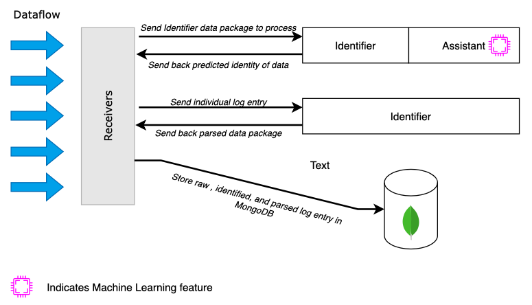

The starting point for creating a Log Ingestion Section is the Receivers. These are available in two variants: UDP and TCP. The primary purpose is to forward any data to them, and the configured Applications will handle the rest of the processing. The goal is to minimize or eliminate the need for configuration changes. A receiver is not bound to a single log source but can process data from multiple log sources simultaneously. For optimal performance, you can scale and deploy as many receivers and applications as needed.

